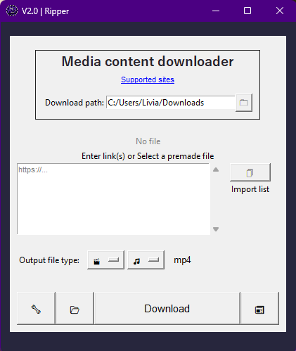

# Ripper Media Downloader

A versatile desktop application for downloading media content from various platforms, built with Python and Tkinter. Supports both video and audio downloads with customizable output formats.


## Features


- **Multi-Format Support (editable in config as long as ffmpeg supports it)**
  - Video formats: avi, mkv, m4v, mov, mp4, webm
  - Audio formats: aac, flac, mp3, ogg, wav, opus
  
- **Flexible Input Options**
  - Direct URL input
  - Batch downloading from text files
  - Multiple URLs simultaneously
  
- **User-Friendly Interface**
  - Straight forward GUI
  - Download progress indicators
  - Customizable download location
  
- **Advanced Features**
  - Console output window for detailed logging
  - Configurable templated filename
  
## Requirements

- Python 3.x
- FFmpeg
- Required Python packages:
  - yt-dlp
  - tkinter

## Installation
Head to the [Releases](https://github.com/99oblivius/obli-ripper/releases) and run the Installer.

## Manual installation:

1. Clone the repository:
```bash
git clone https://github.com/yourusername/ripper.git
cd ripper
```

2. Install dependencies:
```bash
pip install yt-dlp tk
```

3. Download and ensure FFmpeg and FFprobe binaries are placed in the correct location:
   - Windows: `%ProgramFiles%\Oblivius\Ripper\bin\`
   - Linux: `/usr/local/bin/Oblivius/Ripper/bin/`

## Usage

Either 
```bash
pip install pyinstaller
pyinstaller --onefile ripper.py
```
or
```bash
python ripper.py
```

2. Set your preferred download path using the browse button (🗀)

3. Input URLs:
   - Paste URLs directly into the text area
   - Or import a file containing URLs using the file selection button (🗍)

4. Select output format:
   - 🎬 for video formats
   - 🎵 for audio formats

5. Click the download button to start.  
If the download progress doesn't start verify the console output window. 
Close and restart to fix.

### Additional Controls

- 📂 - Open downloads folder
- 🔧 - Open local files directory
- 📰 - Toggle console output window

## Configuration

The application stores its configuration in:
- Windows: `%AppData%\LocalLow\Oblivius\Ripper\config.conf`
- Linux: `~/.config/Oblivius/Ripper/config.conf`

Configurable options include:
- Download path
- Debug level
- Default container format
- Output template
- Supported formats

## Logs

Log files are stored in:
- Windows: `%AppData%\LocalLow\Oblivius\Ripper\Logs\`
- Linux: `~/.config/Oblivius/Ripper/Logs/`

The application maintains the last 10 log files.

## Supported Sites

This application uses yt-dlp and supports numerous websites. For a full list of supported sites, click the "Supported sites" link in the application or visit the [yt-dlp supported sites](https://github.com/yt-dlp/yt-dlp/blob/master/supportedsites.md).
Disclaimer: Authentication is not yet supported but could be a future feature.

## Acknowledgments
- [yt-dlp](https://github.com/yt-dlp/yt-dlp) for the download functionality
- [FFmpeg](https://ffmpeg.org/) for media processing